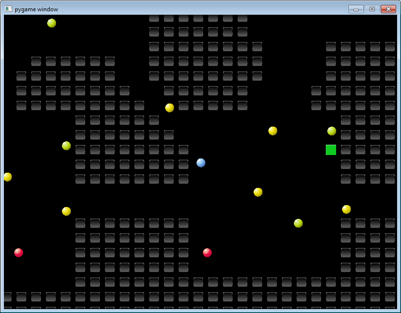
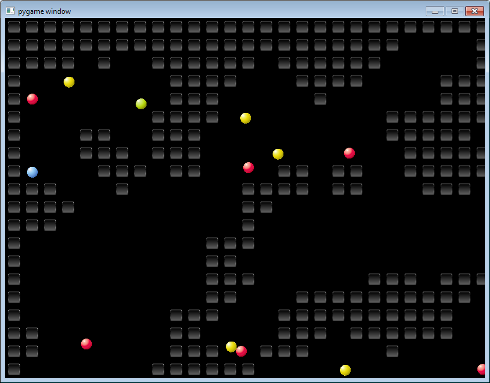

<h1 align="center">Игра "Выход из пещеры"</h1>

## Описание программы

Программа - это игра на двумерном поле с управлением с клавиатуры. 

Цель игры - провести синий шар к выходу из пещеры, минуя все остальные шары. Управление шаром осуществляется курсорными клавишами. Выход представляет собой зеленый прямоугольник.

Игра имеет несколько уровней, с повышением уровня число шаров увеличивается. При проигрыше игра возвращается на первый уровень. 

Карта пещеры, местоположение управляемого шара, шаров-противников и блока выхода генерируются случайным образом. 

## Техническое задание

### Цель создания программы
Создать двумерную игру с простой графикой и управлением с помощью мыши и/или клавиатуры.

### Функциональные требования
- В программе должна быть реализована реакция на действия пользователя через события мыши и/или клавиатуры
- В программе должно быть реализовано движение и взаимодействие персонажей между собой и с другими объектами с помощью спрайтов
- Программа должна осуществлять слежение за главным персонажем с помощью разработанного объекта - камеры
- Программа должна содержать игровой процесс: начало игры, завершение игры при победе или поражении игрока
- В игре должны быть реализованы как минимум 2 уровня или 2 режима игрового процесса 

### Нефункциональные требования 

#### Интерфейс пользователя
- Графический интерфейс пользователя должен быть реализован с помощью библиотеки pygame

#### Требования к надежности
- Необходимо предусмотреть блокировку некорректных действий пользователя при работе с программой

#### Требования к производительности
- Программа должна стабильно работать при большом размере карты и персонажей
- Процесс загрузки игры не должен превышать 20 секунд
- Процесс загрузки уровня не должен превышать 10 секунд
 

## Руководство пользователя

### Старт игры

При запуске игры перед пользователем возникает окно с названием игры и кратким описанием. Также предложены действия: нажатие клавиши **Пробел** - начать игру, нажати клавиши **Escape** - выход из программы. При нажатии клавиши **Пробел** на несколько секунд появляется окно с указанием уровня (первого), а затем загружается сам уровень.

### Игровой процесс

Уровень представляет собой случайно сгенерированную карту, где часть ячеек является непроходимыми стенками. С помощью курсорных клавиш пользователь может управлять синим шаром. 

Помимо него на карте есть вражеские шары, которые перемещаются по прямой, колеблясь между стенками. Цвет вражеских шаров соответствует их скорости: желто-зеленые - медленные, желтые - со средней скоростью, розовые - быстрые. Если синий шар касается любого из шаров, игрок проигрывает.

Выход, к которому нужно провести синий шар - это зеленый прямоугольник. Цель игрока - найти выход на карте, лавируя между вражескими шарами.

### Повышение уровня

В случае выигрыша - достижения выхода - загружается следующий уровень игры. С повышением уровня количество вражеских шаров увеличивается. 

Также с изменением происходит чередование двух видов карт: пещера в виде комнат, соединенных тоннелями, и пещера в виде лабиринта с изрезанными стенками и извилистыми коридорами. Генерация карт пещер происходит случайным образом.

### Проигрыш

При проигрыше - пересечении с вражеским шаром - открывается окно с предложением начать игру с начала (с первого уровня) по нажатию клавиши **Пробел** или выйти из игры по нажатию клавиши **Escape**.

### Выход из игры

Завершить игру можно в любой момент с помощью закрытия окна или нажатием клавиши **Escape**.

## Программные требования

Программа написана на языке Python3 и требует установленного интерпретатора для запуска.
Необходимые библиотеки Python3:
- numpy
- pygame

  
## Установка и запуск

Программа содержит основной запускаемый модуль **main.py** и набор модулей в директории **modules**, описывающих дополнительные окна и виджеты и подгружаемых автоматически.

В директории **data** содержатся дополнительные файлы - тайлы для объектов игры.

Установки программы не требуется. Для запуска программы следует запустить в интерпретаторе (с установленными требуемыми библиотеками) файл **main.py**.

## Особенности реализации

Основной игровой процесс описан в классе **Game** из файла Game.py. В частности, весь цикл игры выполняется методом **game**.

Описание класса **Game**:
- атрибут **MAP_TYPES** содержит возможные типы карт
- атрибут **TILE_IMAGES** содержит унифицированное описание возможных тайлов (в программе используются не все приведенные тайлы).
- метод **__init__** создает основные поля класса. Часть параметров игры, касающаяся параметров окна и карты, выведена в класс **Settings**, объект которого создается как поле класса **Game**.
- метод **new_level** выполняет настройку нового уровня, очистку групп спрайтов, вызывает методы для генерации карты и заполнения групп спрайтов.
- метод **reset_first_level** устанавливает состояние параметров для сброса уровня игры на первый.
- метод **generate_level** вызывает генерацию карты в формате numpy (массива), вызывает генерацию тайлов и установку камеры на управляемого персонажа.
- метод **generate_map** - вспомогательный метод, выполняющий шаги для генерации массива карты.
- методы **load_image**, **set_images** - выполняют загрузку изображений тайлов.
- метод **set_tiles** генерирует тайлы (в соответствии с массивом карты): стен, управляемого шара, вражеских шаров, выхода. Для стен и выхода используется класс-спрайт **Tile**, для управляемого шара - **Player**, для вражеских шаров - **Enemy**.
- методы **start_game_screen**, **start_level_screen**, **fall_screen** отображают вспомогательные экраны: стартовый экран, экран перед загрузкой уровня и экран при проигрыше соответственно.
- метод **check_end_level** проверяет условия завершения уровня (победа и проигрыш)
- метод **run_level** содержит основной цикл отрисовки с обработкой потока событий - в ходе прохождения уровня.
- метод **terminate** предназначен для завершения работы программы.
- метод **game** содержит цепочку вызовов других методов для функционирования всей игры.

Файл **Sprites.py** содержит классы спрайтов и групп спрайтов.

Файл **Camera.py** содержит класс **Camera** для слежения за управляемым шаром. Предусмотрено прекращение слежения при приближении к границе карты.

Файл **Board.py** содержит класс **Board**, описывающий массив карты уровня. Карта уровня описывается массивом numpy и содержит информацию только о расположении стен и открытых участков. 

Файл **Rooms.py** содержит класс **Chamber**, являющийся наследником класса Board и создающий массив карты уровня в виде комнат, соединенных тоннелями. Помимо него в файле содержатся вспомогательные классы для генерации карты. Генерация выполняется по алгоритму: разбиение пространства на ячейки, генерация комнат в ячейках, генерация коридоров между соседними комнатами. Идея алгоритма взята из статьи <a>https://habr.com/ru/post/461087/</a>. Полная генерация карты в этом классе (как и в следующем) выполняется специальным методом **final**.

Файл **Cave.py** содержит класс **Cave**, являющийся наследником класса Board и создающий массив карты уровня в виде пещеры естественного вида. Для этого был использован классический способ генерации пещер — использование клеточного автомата. Параметры клеточного автомата были подобраны перебором для создания извилистой, но при этом максимально связной пещеры. Удаление изолированных ячеек и блоков ячеек ("островов") было реализовано с помощью алгоритма подсчета кластеров, при этом определялся самый большой кластер, остальные удалялись. 

Классы, связанные с генерацией пещер, по сути отделены от игры. Они разрабатывались таким образом, чтобы их можно было использовать и в других программах. 

## Дальнейшее развитие

Данную игру можно развить далее в следующих направлениях:
- Разработать более сложное поведение вражеских шаров.
- Добавить ограничение по времени на прохождение карты.
- Сохранять статистику игроков, рекорды.
- Возможно создание другого режима игры - например, сбор предметов по карте.

